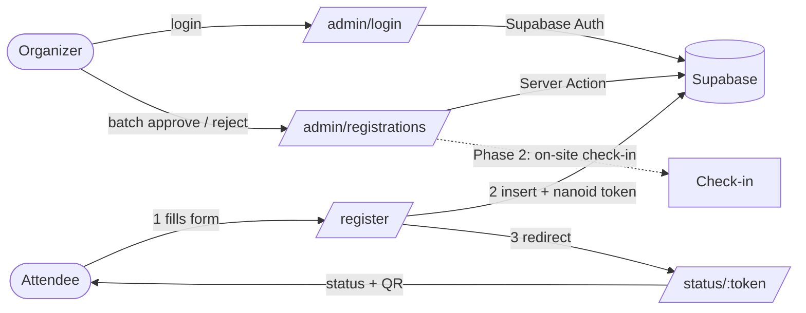

# RSVP Demo

A lightweight event registration management system — replacing the "manage RSVPs in a spreadsheet + email" workflow with a real product flow: attendees register and track their status by token; organizers review and manage the list in batches.

**Live demo:** https://r-khiong-rsvp.netlify.app

> Portfolio project demonstrating a full SDLC walkthrough (PRD → user flow → sprint backlog → implementation → deploy) and a PM-led, AI-assisted development workflow. Not a production SaaS.
> The PM × AI decision boundary that governs this repo is documented in [`CLAUDE.md`](CLAUDE.md).

---

## Problem

Event organizers managing 50+ attendees still default to Google Forms, spreadsheets, and email threads: no single source of truth, no self-service status lookup for attendees, and error-prone manual approval. This demo provides:

- **Attendees** — fill in a form, get a private status link, check their approval status.
- **Organizers** — review the registration list, filter by status, and approve/reject in batches.

## PM Highlights

This project is judged by its decision trail, not its feature count. Full trade-offs live in [`docs/decision-log.md`](docs/decision-log.md); three examples:

- **Scope discipline: 8 → 4 user stories.** The original PRD scoped 8 stories; MVP shipped 4 (register / review / status / check-in-ready). The rest are documented as *deferred, not dropped* — and check-in itself was later moved to Phase 2 to protect a 100%-complete core loop.
- **A recorded requirements pivot.** Three days after PRD v0.3 locked per-row + batch approval, the model was re-locked to **batch-only** — because organizers review a batch and decide a batch. The pivot, its date, and its reasoning are all traceable.
- **Honest sprint accounting.** Sprint v2 was interrupted by a pre-scheduled trip and closed at 0/4 shipped rather than retroactively extending its dates (a ScrumBut anti-pattern); recovery happened in an explicitly-labelled Sprint v3.

The PM × AI collaboration model behind all of this — decision layer vs implementation layer, with escalation rules — is documented in [`CLAUDE.md`](CLAUDE.md).

## User Flow



## Features

| Flow | Status |
|------|--------|
| Register (`/register`) → submit → private status page (`/status/[token]`) | ✅ Live |
| Token-scoped status lookup (RPC; no public access to the full list) | ✅ Live |
| Admin login + registrations table + status filter + batch approve/reject | ✅ Live |
| Status page with QR code (token status URL, ready for on-site verification) | ✅ Live |
| On-site check-in (QR scan + manual check-in + search) | Phase 2 backlog |

## Tech Stack

| Layer | Choice |
|-------|--------|
| Framework | Next.js 16 (App Router) |
| Runtime | React 19 (Server Components by default) |
| Language | TypeScript (strict) |
| Styling | Tailwind CSS v4 (CSS-first `@theme`) |
| UI | shadcn/ui (radix-nova) + lucide-react |
| Forms | react-hook-form + zod |
| Auth + DB | Supabase (Postgres, Row Level Security) |
| Hosting | Netlify (git-linked continuous deploy) |
| Package manager | pnpm |

## Product Docs

Product-level documents live in this repo — the PRD is a living document; git history is its version trail.

- [`docs/PRD.md`](docs/PRD.md) — problem definition, scope, user stories, acceptance criteria
- [`docs/decision-log.md`](docs/decision-log.md) — every product and technical decision with its trade-off
- [`docs/handoffs/`](docs/handoffs/) — PM → implementation handoff documents

## Local Setup

```bash
pnpm install

# Create .env.local with your Supabase project keys:
# NEXT_PUBLIC_SUPABASE_URL=...
# NEXT_PUBLIC_SUPABASE_ANON_KEY=...

pnpm dev      # http://localhost:3000
pnpm build    # production build
```

Database schema and RLS policies live in [`supabase/migrations/`](supabase/migrations/) and are applied via the Supabase Dashboard SQL Editor.

## Architecture & Decisions Log

Highlights below — the full log with trade-offs is in [`docs/decision-log.md`](docs/decision-log.md).

- **Batch-only action model.** The admin table offers batch approve/reject only — no per-row action buttons. This mirrors how organizers actually work (review a batch, decide a batch) and keeps the status state machine simple. Informed by the author's event-operations background.
- **Token-scoped reads via RPC.** The status page never reads the `registrations` table directly. A `SECURITY DEFINER` function `get_registration_by_token(token)` returns only the single matching row; anonymous `SELECT` on the table is revoked. This closes a PII-exposure hole (the public anon key could otherwise dump the whole list) while keeping the attendee flow working. See [`supabase/migrations/20260603120000_harden_registrations_rls.sql`](supabase/migrations/20260603120000_harden_registrations_rls.sql).
- **Role separation by design.** Anonymous users may only `INSERT` (register) and call the token RPC. Admin (authenticated) full-table access is granted separately, so the public and admin paths never overlap.
- **Scope discipline as a feature.** On-site check-in and email notifications were deliberately deferred to Phase 2 even though technically feasible — the goal is one core flow shipped end-to-end at 100%, not feature count.
- **Server Components by default.** Client components (`'use client'`) are used only where interaction requires it (e.g. the registration form).
- **Continuous deployment.** `main` auto-deploys to production on Netlify; feature branches get isolated deploy previews.

## Roadmap

- **RSVP-7** — story landing at root: problem, core flow, key decisions, and the full artifact chain on one page.
- **RSVP-8** — read-only admin demo: one-click entry with seeded data, writes denied at the RLS layer.
- **Phase 2 backlog** — on-site check-in (QR scan + manual), interactive demo sandbox with data reset, email notifications, calendar export (.ics).

---

## Author

**r.khiong** — PM transitioning into software project management.

[LinkedIn](https://www.linkedin.com/in/renatajiang) · [GitHub](https://github.com/r-khiong)
